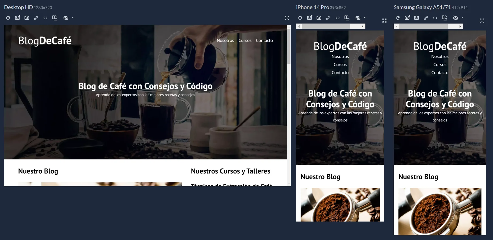
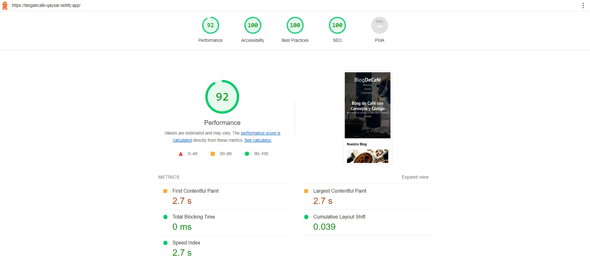

# Blog de Café

Este es un proyecto de blog de café simple y elegante creado con HTML y CSS. El objetivo principal de este proyecto es proporcionar un sitio web atractivo y funcional para compartir información y noticias relacionadas con el café.

## Visita el sitio (DEMO)

¡Explora el blog de café en [BlogDeCafé](https://blogdecafe-qaysar.netlify.app/) para interactuar con el demo!

## Características

1. **Diseño Responsivo**: El blog está diseñado para adaptarse a diferentes tamaños de pantalla, lo que garantiza una experiencia de usuario óptima en dispositivos móviles y de escritorio.

2. **Mejoras de Rendimiento**:
   - **Lazy Loading**: Las imágenes se cargan de forma diferida, mejorando el tiempo de carga inicial y reduciendo el consumo de ancho de banda.
   - **Preload y Prefetch**: Se han utilizado las etiquetas `<link>` para precargar recursos esenciales y prefetching para recursos secundarios, mejorando aún más el rendimiento de carga de la página.
   - **Webp**: Las imágenes se han optimizado en el formato Webp para reducir el tamaño del archivo sin comprometer la calidad visual.

3. **Compatibilidad con Navegadores**:
   - **Modernizr**: Se utiliza Modernizr para detectar las capacidades del navegador y aplicar estilos y comportamientos específicos según sea necesario, garantizando una experiencia consistente en todos los navegadores.

## Screenshot Diseño Responsivo

## Instalación y Uso

1. Clona este repositorio: `git clone https://github.com/tu-usuario/blog-cafe.git`
2. Abre el archivo `index.html` en tu navegador.

## Rendimiento (Auditoría con Lighthouse)

## Contribuciones

¡Las contribuciones son bienvenidas! Si encuentras algún problema o tienes sugerencias para mejorar el blog, no dudes en abrir un problema o enviar una solicitud de extracción.

## Licencia

Este proyecto está bajo la Licencia MIT.
